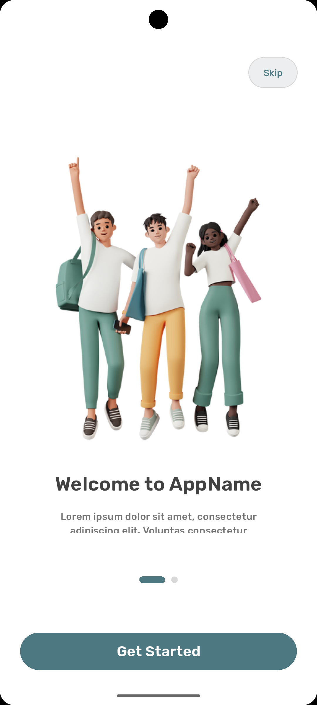
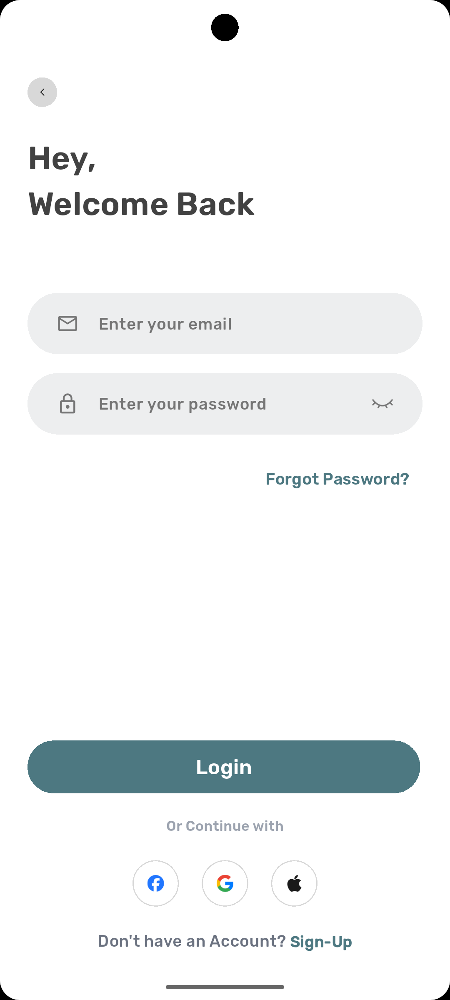
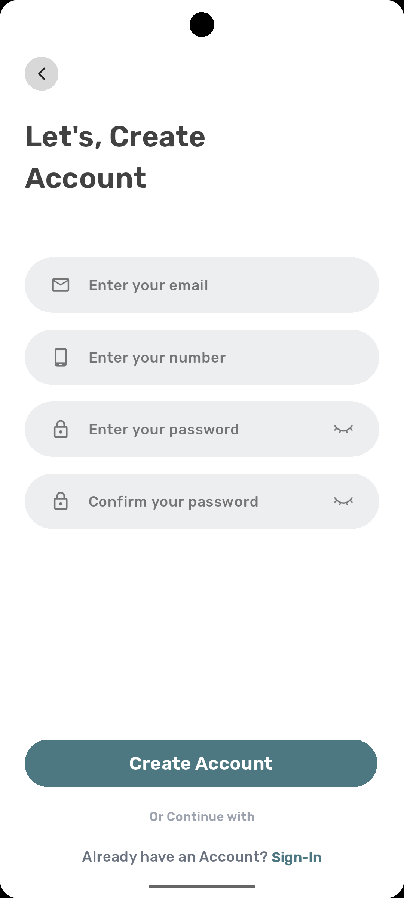

# Cool Login App 

A modern, responsive, and clean Flutter authentication UI project featuring Onboarding, Login, and Sign-Up screens.
This project is built with a focus on high-quality UI/UX and cross-device compatibility.

## Features

- **Onboarding Experience**: Smooth introduction with a PageView and smooth page indicators.
- **Modern Login Screen**: Clean layout with social login integration (Google, Facebook, Apple).
- **Responsive Sign-Up**: Complete registration form with custom-designed text fields and validation-ready layout.
- **Custom Widgets**: Reusable components like `CustomElevatedButton` and `CustomTextField`.
- **Responsive Design**: Powered by `flutter_screenutil` to ensure perfect scaling on all screen sizes.
- **Beautiful Typography**: Integrated with `google_fonts`.

## Screenshots

|                     Onboarding                     |                     Login                     |                     Sign Up                     |
|:--------------------------------------------------:|:---------------------------------------------:|:-----------------------------------------------:|
|  |  |  |

## Tech Stack

- **Flutter**: Cross-platform framework.
- **Dart**: Programming language.
- **flutter_screenutil**: For responsive UI.
- **smooth_page_indicator**: For onboarding dots.
- **google_fonts**: For professional typography.

## 📂 Project Structure

```
lib/
├── screens/         # UI Screens (Onboarding, Login, Signup)
├── widgets/         # Reusable Custom Components
├── Utils/           # App Constants (Colors, Styles)
└── main.dart        # Entry point
```

Developed by [Amira Abdel-Fattah](https://github.com/AmiraAbdel-fatah)
